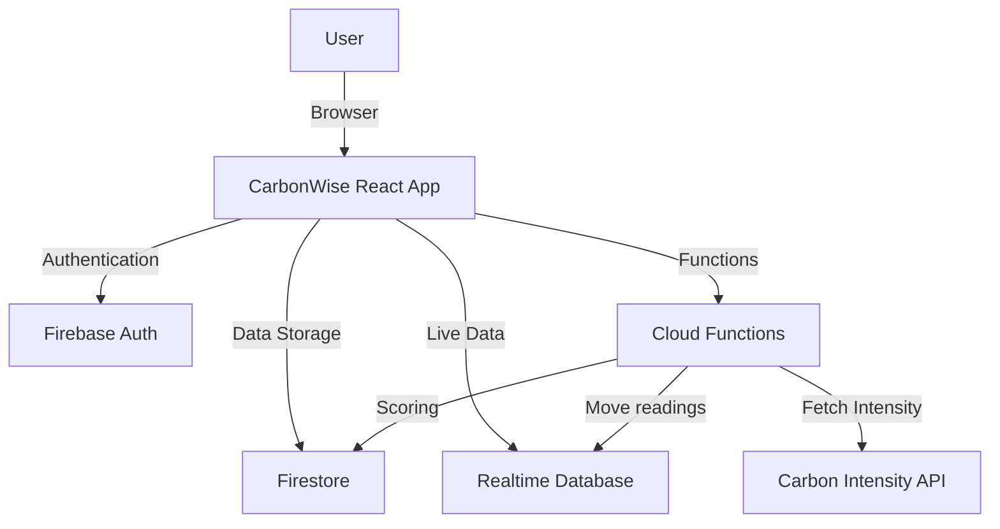

# CarbonWise

**A Web App Solution for Carbon-Intelligent Energy Consumption in UK Households**  
*(Based on the dissertation by Dan Bell — “A Web App Solution for Carbon-Intelligent Energy Consumption in UK Households”)*

[Live Demo](https://carbonwise-c60a4.web.app)  
[Dissertation Document](https://docs.google.com/document/d/1teqLAsV8lUGfCb85XWZpV2zNoaaCLxbXbNctbhDNmVs/edit?usp=sharing) <!-- Update link if hosting the PDF in the repo -->

---

## Table of Contents

- [Overview](#overview)
- [Key Features](#key-features)
- [Tech Stack](#tech-stack)
- [Project Architecture](#project-architecture)
- [Getting Started](#getting-started)
  - [Prerequisites](#prerequisites)
  - [Installation](#installation)
  - [Running the App](#running-the-app)
- [Usage](#usage)
- [Research & Methodology](#research--methodology)
- [Credits & Acknowledgments](#credits--acknowledgments)
- [License](#license)

---

## Overview

**CarbonWise** is a web-based application designed to encourage more sustainable energy consumption within UK households. It provides real-time visibility into both a user’s energy usage and the UK grid’s carbon intensity data. By monitoring your carbon footprint and offering actionable suggestions, CarbonWise empowers users to optimize when they consume energy, reducing both costs and environmental impact.

### Key Goals:
1. **Real-time Energy Monitoring** – Connect to a smart meter or simulated device for immediate feedback on usage.
2. **Carbon-Intensity Data Integration** – See current and forecasted intensity levels (low, medium, high) based on your location.
3. **Behavioral Nudges** – Receive prompts to shift high-energy tasks to greener times of the day.
4. **Gamification** – Track your “carbon score” over time and get motivational tips to keep reducing your consumption.

---

## Key Features

- **Live Dashboard**  
  Displays real-time energy usage in a simple gauge format and quick stats on carbon intensity.

- **Carbon Intensity Forecasting**  
  Visual charts and intuitive cards showing upcoming low/high carbon intensity periods for better planning.

- **Historical Data & Trends**  
  Look back at past energy usage and carbon intensity data to track and compare performance.

- **Daily Carbon Score**  
  See how your household stacks up against optimal (lowest possible) carbon usage scenarios. This score updates daily.

- **Device Pairing & Monitoring**  
  Quickly pair your account with a compatible device (or a simulated data source) to start seeing live usage data.

- **Responsive, Modern UI**  
  Designed mobile-first, with collapsible side navigation and optimized layouts for desktop.

---

## Tech Stack

- **Frontend**: [React.js](https://reactjs.org/) + [Tailwind CSS](https://tailwindcss.com/)
- **Backend Services**: [Firebase](https://firebase.google.com/) (Firestore, Realtime Database, Cloud Functions)
- **Data Sources**: [National Grid Carbon Intensity API](https://carbonintensity.org.uk/)
- **Graphs & Charts**: [Recharts](https://recharts.org/)
- **Deployment**: Firebase Hosting

---

## Project Architecture



---

## Getting Started

### Prerequisites

- [Node.js](https://nodejs.org/) v14 or above  
- [Firebase CLI](https://firebase.google.com/docs/cli) (optional, for deployment/emulation)

### Installation

1. **Clone the repo**:
   ```bash
   git clone https://github.com/YourUsername/CarbonWise.git
   ```
2. **Navigate to the project folder**:
   ```bash
   cd CarbonWise
   ```
3. **Install dependencies**:
   ```bash
   npm install
   ```

### Running the App

1. **Start the local dev server**:
   ```bash
   npm run start
   ```
2. **Open your browser** at:
   ```
   http://localhost:3000
   ```
3. **Firebase Emulation (Optional)**:
   ```bash
   firebase emulators:start
   ```

---

## Usage

1. **Sign Up / Login**  
   Create a new account or sign in with existing credentials (Email/Password, Google, etc.).

2. **Pair Your Device**  
   - Navigate to **Devices** in the side menu.  
   - Enter your smart meter / simulation details.  
   - If you’re testing, you can use the provided “demo” script or dummy device ID for immediate usage data.

3. **View Live Usage**  
   - On the **Dashboard**, see real-time usage on a gauge chart.  
   - The left panel shows if your device is connected (pulsating green dot).

4. **Check Carbon Intensity**  
   - Go to **Carbon Intensity** to see whether your region’s electricity is generated from high-carbon sources or renewables.  
   - The **Forecast** tab highlights upcoming low-carbon windows to plan energy-heavy tasks.

5. **Monitor Your Carbon Score**  
   - Observe how effectively you shifted usage to greener periods.  
   - Aim for a higher daily score each day by running appliances (laundry, dishwasher, EV charging) during low-carbon hours.

---

## Research & Methodology

This project follows a **user-centred, iterative design process** based on user interviews, persona creation, and continuous feedback.

For a detailed overview, including literature review, technical architecture, user evaluations, and full references, please refer to the [Dissertation Document](./Dissertation.pdf).

---

## Credits & Acknowledgments

- **Dan Bell** – Dissertation author and developer.  
- **Project Supervisor**: Ian Johnson  
- **Contributors**:  
  - Interview participants and user testers.  
  - Thanks to [carbonintensity.org.uk](https://carbonintensity.org.uk/) for the Carbon Intensity API.

---

## License

Distributed under the [MIT License](LICENSE). See `LICENSE` for more information.

---

### Questions or Feedback?

Open an [issue](https://github.com/YourUsername/CarbonWise/issues) or reach out via [email](mailto:you@example.com).

> _“Empowering households to make greener choices, one kilowatt-hour at a time.”_

